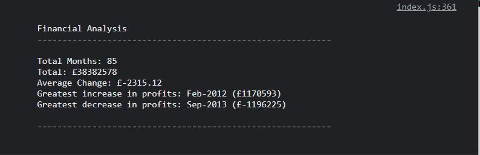

# trilogy-bootcamp-console-finances

## Working with Arrays - Analysing the financial dataset of a company.

## The following is the acceptance criteria for this project.

You have been given a dataset composed of arrays with two fields, Date and Profit/Losses.

Your task is to write JavaScript code that analyzes the records to calculate each of the following:

The total number of months included in the dataset.

The net total amount of Profit/Losses over the entire period.

The average of the changes in Profit/Losses over the entire period.

     - You will need to track what the total change in profits are from month to month and then find the average. (Total/Number of months -1)

The greatest increase in profits (date and amount) over the entire period.

The greatest decrease in losses (date and amount) over the entire period.

When you open your code in the browser your resulting analysis should look similar to the following:

## Financial Analysis

Total Months: 25
Total: $2561231
Average  Change: $-2315.12
Greatest Increase in Profits: Feb-2012 ($1926159)
Greatest Decrease in Profits: Sep-2013 ($-2196167)

Your final code should print the analysis to the console.

## Images of final result to the console

## Link to the deployed application

https://sho-ayb.github.io/trilogy-bootcamp-console-finances/
